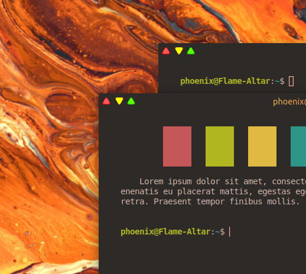

# PhoenixOS window header bar controls
## Plugin made for [Hyper terminal](https://hyper.is/)

Added window header bar controls just like in official PhoenixOS design

**Instalation**
```bash
$ hyper i hyper-phx-controls
```
<br>
<div align="center">
  
</div>